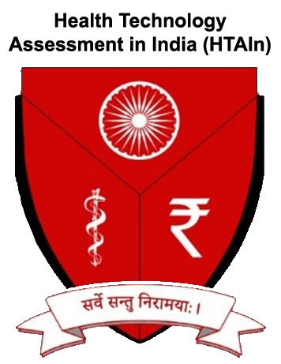

::: {layout="[30,40,30]" layout-valign="center"}

{width=120 fig-align="center"}

::: {.text-center}
**Organised by**

Regional Resource Centre for Health Technology Assessment

All India Institute of Medical Sciences, Bhopal

*Under the aegis of Health Technology Assessment in India (HTAIn), Department of Health Research*
:::

{width=120 fig-align="center"}

:::

---

## Welcome

This workshop introduces R as a tool for health technology assessment. It is designed for scientists at Regional Resource Centres (RRCs), health economists, and anyone working in or interested in HTA who currently uses Excel or TreeAge and wants to explore what R can offer.

**This is not a coding bootcamp.** You will not memorise R syntax. Instead, you will:

- Understand *why* R is increasingly preferred for HTA in academic and policy settings
- See real-world Indian HTA examples implemented in R
- Learn to *read* R code well enough to understand what a model is doing
- *Modify* existing code — change inputs, adapt parameters, rerun analyses
- Take home ready-to-use templates for four common HTA model types
- Learn how to use available tools (including generative AI) to support your R workflow

## What You Will Work With

Over three days, you will explore four HTA models grounded in Indian clinical and economic data:

| Model | Clinical Question |
|---|---|
| **Diagnostic Decision Tree** | Should we implement universal screening for gestational diabetes using OGTT vs risk-based screening? |
| **Therapeutic Decision Tree** | Are drug-eluting stents cost-effective compared to bare metal stents for coronary artery disease in the Indian setting? |
| **4-State Markov Model** | Is early CKD screening and ACE-inhibitor intervention cost-effective compared to standard care? |
| **Partitioned Survival Model** | Is trastuzumab cost-effective for HER2+ breast cancer in India? |

## Materials

Each session includes **annotated explanatory modules** (viewable on this website), plus **downloadable exercise and solution .qmd files** that you open in RStudio. Four interactive **Shiny app templates** are also provided.

Visit the [Downloads](downloads.qmd) page to get all exercise files, solution files, and Shiny app code.

## Before You Begin

Please ensure you have:

1. **R** installed (version 4.3 or later) — [Download R](https://cran.r-project.org/)
2. **RStudio** installed — [Download RStudio](https://posit.co/download/rstudio-desktop/)
3. Required packages installed — run the setup code in the [Setup Guide](resources/setup-guide.html)

## Navigation

Use the navigation bar above to move between sessions, or follow the [Workshop Schedule](schedule.qmd) for the recommended sequence.
